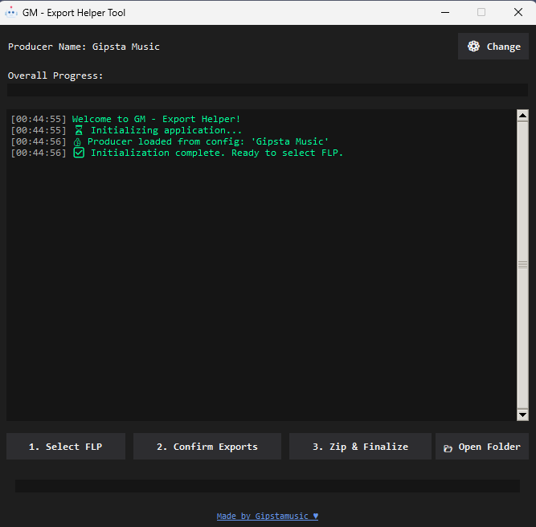

# GM - Export Helper Tool for FL Studio

A lightweight, automated desktop utility for music producers to streamline the process of organizing, stemming, and zipping FL Studio exports. 

 <!-- Remember to put your image in an assets folder! -->

## 🌟 Features
* **Automated Folder Structures:** Automatically reads your `.flp` filename and creates the appropriate stem folders and dummy files.
* **Smart Verification:** Checks file modified times to ensure you actually exported and overwrote the dummy files.
* **Auto-Zipping:** Automatically compiles your `.wav` stems into a cleanly named `.zip` archive.
* **File Cleanup:** Moves final assets to your project directory and deletes temporary folders automatically.

## 📥 Download and Installation

**For Producers (No coding required):**
1. Go to the [Releases page](../../releases/latest).
2. Download the latest `GM_ExportHelper.zip` file.
3. Extract the `.exe` anywhere on your computer (e.g., your Desktop or Music Production folder) and run it.

> **⚠️ Note on Antivirus:** This tool is packaged using PyInstaller. Sometimes, Windows Defender or web browsers will flag it as a false positive. This is common for Python executables. The tool is 100% safe, and the open-source code is available in this repository for full transparency.

## 📖 How to Use (Step-by-Step)

Before starting, ensure your FL Studio project file is named correctly[cite: 2]. The tool expects this format: `Title - BPM - Key - Artist.flp` (example: `Dreams - 140 - C# Minor - Gippy.flp`)[cite: 2].

### Step 1: Set Your Producer Name
* Open the app[cite: 2].
* Click the **⚙️ Change** button at the top[cite: 2].
* Enter your producer name (example: Gippy) and save it[cite: 2].

### Step 2: Select Your FLP Project
* Click the **1. Select FLP** button[cite: 2].
* Browse and select your correctly named `.flp` file[cite: 2].

### Step 3: Export Your Files in FL Studio
* After selecting your FLP, the app will create special folders and dummy files for you automatically[cite: 2].
* Go to FL Studio and export your files[cite: 2]:
  * Export your **main MP3 and WAV files** into the new folder created (you’ll see it)[cite: 2].
  * Export your **stems** into the subfolder named **Stems** inside that folder[cite: 2].
* **Important:** Overwrite the dummy files when you export[cite: 2]!

### Step 4: Confirm Your Exports
* After exporting from FL Studio, click the **2. Confirm Exports** button in the app[cite: 2].
* The app will check if your exports were saved correctly[cite: 2].
* If anything is missing, it will warn you and guide you what to fix[cite: 2].

### Step 5: Zip and Finalize
* When your exports are confirmed, click **3. Zip & Finalize**[cite: 2].
* The app will bundle your stems into a neat ZIP file and move all your exported files into the correct folder automatically[cite: 2].

### Step 6: Open Your Final Folder
* Click **📂 Open Folder** to quickly view your finished files[cite: 2].
* You are now ready to upload, send, or publish your beat[cite: 2]!

## 🛠️ Troubleshooting

* **Producer Name Missing:** Set it using the ⚙️ Change button first[cite: 2].
* **Filename Error:** Make sure your FLP file name follows the format: Title - BPM - Key - Artist.flp[cite: 2].
* **Dummy Files Not Overwritten:** Make sure you export over the dummy files created by the app[cite: 2].
* **Folder Not Opening:** Ensure the project folder still exists where you saved it[cite: 2].

## 📄 License
This project is licensed under the MIT License - see the `LICENSE` file for details.

## ❤️ Support
Made by Gipstamusic. 
[All Socials](https://lnk.bio/gipstamusic)